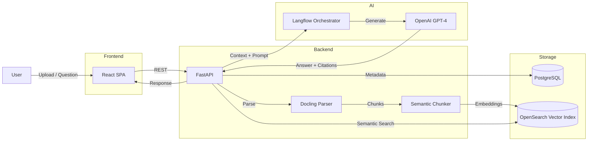
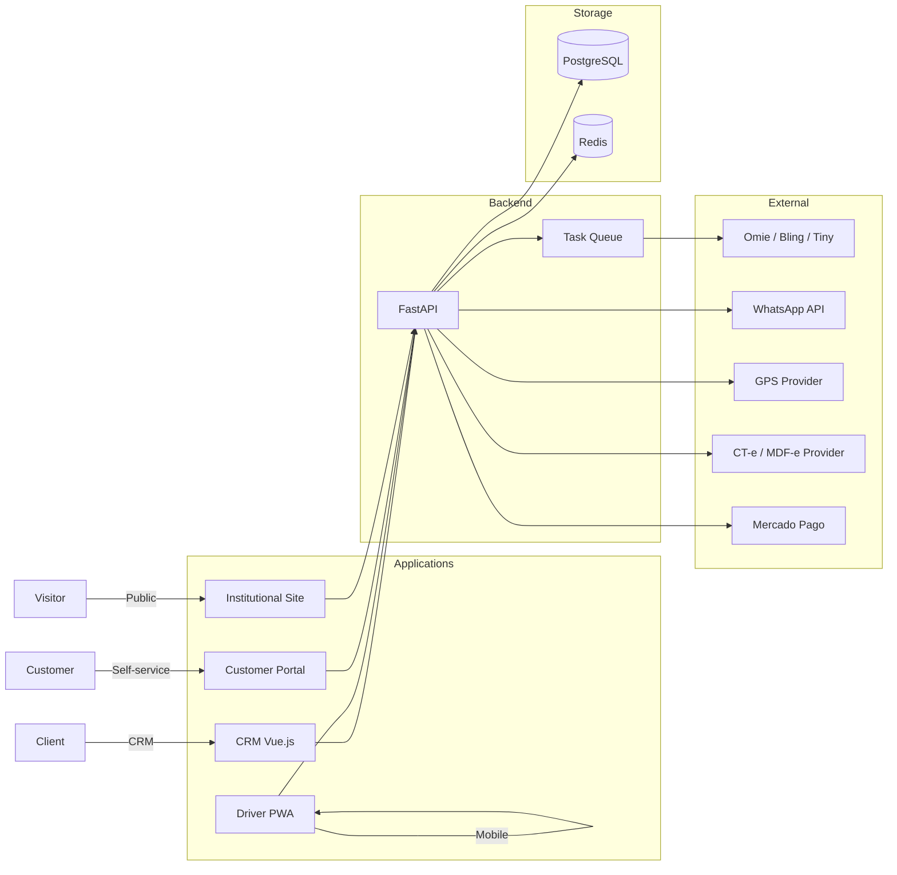
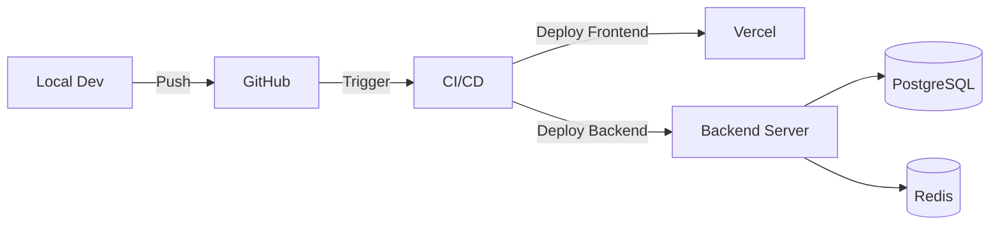

# Architecture Diagrams — Featured Projects

---

## 1. Oráculo IA

### High-Level Architecture



### Data Flow

1. User uploads a document.
2. Docling parses PDF, image or Office file.
3. Content is chunked and embedded.
4. Embeddings are stored in OpenSearch.
5. User asks a question.
6. Backend retrieves relevant chunks.
7. Langflow builds a prompt with context.
8. GPT-4 generates a cited answer.
9. Frontend displays answer with source references.

---

## 2. ProFlow AI

### High-Level Architecture

```mermaid
flowchart LR
  subgraph Client
    Vue[Vue.js 3 SPA]
    PWA[Mobile PWA]
  end

  subgraph Backend
    Django[Django REST]
    WS[WebSocket Server]
    AI[OpenAI GPT-4]
  end

  subgraph Storage
    Postgres[(PostgreSQL)]
    Redis[(Redis)]
    Storage[Cloud Storage]
  end

  subgraph Payments
    MP[Mercado Pago]
    Asaas[Asaas]
  end

  User -->|Browser| Vue
  User -->|Mobile| PWA
  Vue -->|REST| Django
  PWA -->|REST| Django
  Vue -->|Chat| WS
  PWA -->|Chat| WS
  Django -->|AI prompts| AI
  Django --> Postgres
  Django --> Redis
  Django -->|Files| Storage
  Django -->|Escrow| MP
  Django -->|Subscriptions| Asaas
  WS --> Redis
```

### Key Components

- **Django REST:** Main API, auth, projects, payments, escrow.
- **WebSocket Server:** Real-time chat between freelancers and clients.
- **Redis:** Cache and WebSocket Pub/Sub.
- **PostgreSQL:** Users, projects, payments, contracts, messages.
- **OpenAI GPT-4:** Pricing assistant, proposal generator, contract review.
- **Mercado Pago / Asaas:** Escrow, subscriptions, PIX payouts.
- **Cloud Storage:** Contracts, proposals, user files.

---

## 3. LogiFlow CRM

### High-Level Architecture



### Multi-App Design

| App | Purpose | Users |
|-----|---------|-------|
| CRM | Sales, operations, billing | Company staff |
| Driver App | Trip execution, delivery proof | Drivers |
| Customer Portal | Tracking, invoices, self-service | Customers |
| Site | Marketing and lead capture | Public |

### Integration Layer

- **ERP Sync:** Bidirectional webhooks for orders, clients and invoices.
- **WhatsApp:** Automated tracking and delivery notifications.
- **GPS:** Real-time driver location updates.
- **Fiscal:** CT-e/MDF-e XML issuance.
- **Payments:** Freight collection via Mercado Pago.

---

## 4. Common Patterns

All three projects use:

- **PostgreSQL** as the primary relational database.
- **Redis** for caching and/or real-time state.
- **Docker** for local development and deployment.
- **REST APIs** for client-server communication.
- **AI/LLM integration** for value-added features.
- **Cloud deployment** (Vercel frontend, backend on VPS/cloud).

---

## 5. Deployment Overview


