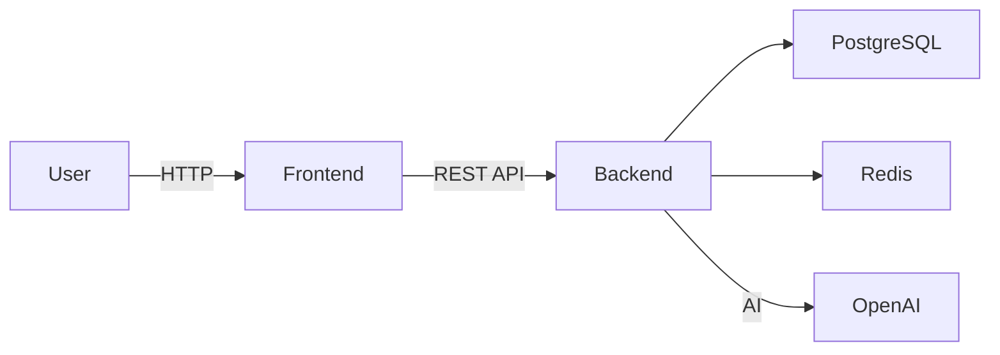

# GitHub Authority Plan — Leonardo Fragoso

**Profile:** https://github.com/LeonardoRFragoso  
**Date:** 2026-06-25  
**Goal:** Make the GitHub profile look like a Senior Backend Engineer.

---

## 1. Current State Assessment

### 1.1 Pinned Repositories

**Current likely state:** 6 pinned repos, probably including a mix of frontend, backend and tutorial projects.

**Recommendation:** Pin only the top 6 backend/AI projects:

1. ProFlow
2. AgentesIA / Oráculo IA
3. LogiFlow
4. Digital Signage Platform
5. APM Platform
6. Assistente Financeiro WhatsApp

### 1.2 README Quality

**Findings:**
- Most repos likely have short READMEs.
- Many lack architecture sections, setup instructions and screenshots.
- Some READMEs may still be in Portuguese only.

**Recommendations:**
- Every Tier 1 and Tier 2 project must have a comprehensive README.
- Each README should include:
  - One-line project description
  - Problem statement
  - Architecture overview
  - Tech stack
  - Screenshots
  - Setup instructions
  - API documentation (if applicable)
  - Deployment notes
  - Future improvements

### 1.3 Screenshots

**Findings:**
- Some projects have screenshots in the portfolio but not in GitHub.
- GitHub repos without visual proof convert poorly.

**Recommendations:**
- Add 3-5 screenshots to each Tier 1 repo.
- Use `/images/` folder or GitHub Assets.
- Include architecture diagrams.

### 1.4 Contribution Graph

**Findings:**
- Contribution graph may be sparse or inconsistent.
- International recruiters look at consistency.

**Recommendations:**
- Make small commits regularly across top projects.
- Fix bugs, update dependencies and improve documentation.
- Aim for at least 3-4 active days per week on the main repos.

### 1.5 Repository Consistency

**Findings:**
- Mixed naming conventions.
- Some repos in Portuguese, some in English.
- Inconsistent tags and topics.

**Recommendations:**
- Use English repo names for international appeal.
- Add topics to every repo: `python`, `django`, `fastapi`, `postgresql`, `docker`, `ai`, `backend`, `api`, `saas`.
- Standardize LICENSE and `.gitignore` files.

---

## 2. Immediate Action Plan

### Week 1 — README Overhaul

- [ ] ProFlow README: architecture, screenshots, API docs, deployment.
- [ ] AgentesIA README: multi-agent architecture, diagram, AI flow.
- [ ] LogiFlow README: multi-app ecosystem, integrations, database schema.

### Week 2 — Secondary Projects

- [ ] Digital Signage README: WebSocket, FFmpeg, Redis, enterprise context.
- [ ] APM Platform README: Spring Boot, clean architecture, metrics.
- [ ] Assistente Financeiro README: Twilio, GPT-4, WhatsApp flow.

### Week 3 — GitHub Profile Optimization

- [ ] Pin top 6 repos.
- [ ] Update GitHub profile README (if not present).
- [ ] Add consistent topics to all repos.
- [ ] Rename repos if needed (keep old URLs redirect).

### Week 4 — Ongoing Maintenance

- [ ] Weekly commits to at least 3 main repos.
- [ ] Respond to issues and update dependencies.
- [ ] Add releases/tags for major milestones.

---

## 3. README Template

```markdown
# Project Name

> One-line value proposition.

## Problem

What business problem this project solves.

## Solution

How the project solves it.

## Architecture



## Tech Stack

- Backend: Python, FastAPI
- Database: PostgreSQL, Redis
- AI: OpenAI GPT-4
- Frontend: Vue.js 3
- Deployment: Docker, Vercel

## Key Results

- 4 integrated apps
- 99.9% uptime
- 50% reduction in manual work

## Screenshots


## Run Locally

```bash
git clone ...
cd project
cp .env.example .env
docker-compose up
```

## API Documentation

Link to Swagger/Redoc.

## Deployment

How it is deployed in production.

## Future Work

- [ ] Feature A
- [ ] Feature B
```

---

## 4. Profile README

Create a `.github/profile/README.md` or user-level `README.md` with:

- Short bio: "Python Backend Developer focused on APIs, AI and enterprise systems."
- Link to portfolio.
- Pinned project highlights.
- Tech stack badges.
- Contact info.

---

## 5. Success Metrics

- All Tier 1 repos have >500 words README.
- All Tier 1 repos have 3+ screenshots.
- Top 6 repos are pinned.
- Contribution graph shows consistent activity.
- Repos have 5+ relevant topics each.

---

## 6. Tools

- GitHub Copilot for README drafting
- Mermaid for diagrams
- Canva or Excalidraw for architecture diagrams
- GitHub Releases for versioning
