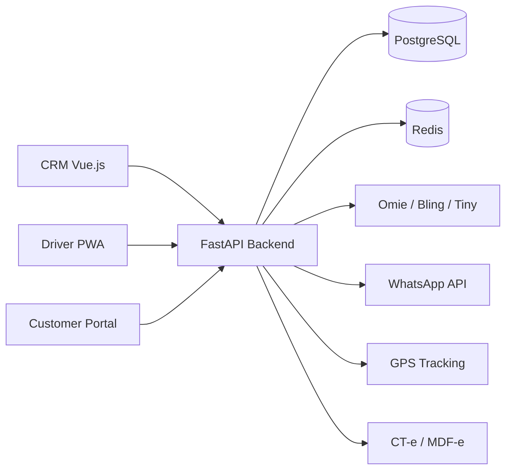

# Case Study — LogiFlow CRM

**Role:** Backend Engineer / System Integrations  
**Stack:** FastAPI, PostgreSQL, Redis, Vue.js 3, WebSocket, ERPs (Omie/Bling/Tiny), WhatsApp, Mercado Pago, GPS  
**GitHub:** https://github.com/LeonardoRFragoso/LogiFlow

---

## 1. Business Problem

Transportation companies and logistics providers use disconnected systems:
- Sales in spreadsheets.
- Operations in one tool.
- Billing in another.
- Tracking in WhatsApp groups.

This creates rework, delays and loss of revenue.

## 2. Solution

LogiFlow CRM unifies commercial, operational and fiscal management in one SaaS platform with four integrated applications:
1. **CRM Principal** — sales, clients, contracts.
2. **App Motorista** — driver trips, delivery confirmation, PWA.
3. **Portal Cliente** — tracking, invoices, self-service.
4. **Site Institucional** — public landing page.

## 3. Technical Architecture

## 4. Database Design

- **Companies:** Multi-tenant schema with isolated data.
- **Clients:** Contacts, contracts, credit limits.
- **Trips:** Route, driver, vehicle, status, GPS tracking.
- **Orders:** Items, freight, CT-e/MDF-e references.
- **Invoices:** NF-e, billing status, payment tracking.
- **Drivers:** Documents, schedules, PWA access.

## 5. API Design

- `GET /clients/{id}` — client profile with order history.
- `POST /trips` — create a new trip and assign driver.
- `GET /trips/{id}/tracking` — live GPS tracking.
- `POST /invoices/{id}/issue` — emit CT-e/MDF-e.
- `POST /webhooks/erp` — receive ERP updates.
- `POST /webhooks/whatsapp` — receive WhatsApp messages.

## 6. Integration Architecture

- **ERPs:** REST webhooks for orders, clients and invoices.
- **WhatsApp:** Incoming/outgoing messages for tracking and delivery confirmation.
- **GPS:** Real-time location updates via mobile driver app.
- **Billing:** Integration with fiscal document providers.
- **Payments:** Mercado Pago for freight payment collection.

## 7. Challenges

- **Multi-tenancy:** Each company must see only its own data.
- **Data consistency:** ERP updates must sync with CRM state.
- **Offline drivers:** PWA must work with poor mobile connectivity.
- **Fiscal compliance:** CT-e/MDF-e requires specific XML schemas.

## 8. Lessons Learned

- Webhook reliability is more important than real-time sync.
- Multi-tenancy should be designed early, not bolted on later.
- Driver UX is critical: simple forms, offline-first, clear status.

## 9. Scalability Considerations

- Shard database by company region.
- Use message queue for ERP sync.
- Cache trip statuses in Redis.
- Separate billing service into microservice.
- Add real-time event bus for driver updates.

## 10. Screenshots

> Add screenshots here.

## 11. GitHub Repository

https://github.com/LeonardoRFragoso/LogiFlow
