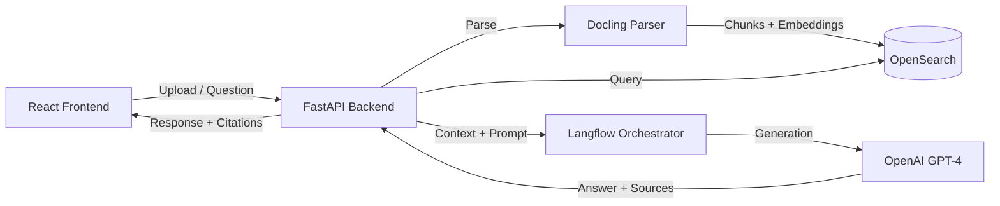

# Case Study — Oráculo IA

**Role:** Backend Engineer / AI Integration  
**Stack:** Python, FastAPI, OpenSearch, Langflow, Docling, Docker, React, OpenAI  
**GitHub:** https://github.com/LeonardoRFragoso/Oraculo  
**Demo:** https://oraculo-ia.vercel.app

---

## 1. Business Problem

Companies generate strategic documents (reports, contracts, spreadsheets, PDFs) but struggle to extract actionable insights quickly. Decision-makers spend hours reading files or searching for information across legacy systems.

## 2. Solution

Oráculo is an AI strategic consultant that:
- Ingests documents in multiple formats.
- Indexes content semantically with OpenSearch.
- Runs an OpenRAG pipeline using Langflow.
- Answers questions in natural language with citations to source documents.

## 3. Technical Architecture

## 4. Database Design

- **Document Store:** Metadata, file paths, status.
- **Vector Index:** OpenSearch for semantic search.
- **Conversation History:** PostgreSQL for chat sessions and audit trail.

## 5. API Design

- `POST /documents` — upload and parse documents.
- `POST /ask` — ask a question and receive a cited answer.
- `GET /conversations/{id}` — retrieve chat history.
- `DELETE /documents/{id}` — remove a document and its embeddings.

## 6. AI Components

- **Document Parsing:** Docling converts PDFs, images and Office files to structured text.
- **Chunking:** Semantic chunking to preserve context.
- **Embeddings:** OpenAI embeddings stored in OpenSearch.
- **RAG Pipeline:** Langflow orchestrates retrieval + generation.
- **Citations:** Source paragraphs are returned with each answer.

## 7. Challenges

- **PDF quality variation:** Some documents had poor OCR or scanned images.
- **Latency:** RAG pipeline required optimization to keep response times under 5s.
- **Citation accuracy:** Needed to prevent hallucinated sources.

## 8. Lessons Learned

- Semantic chunking beats fixed-size chunking for technical documents.
- OpenSearch k-NN search is fast enough for MVP but needs tuning at scale.
- Docker Compose simplifies local setup for AI-heavy stacks.

## 9. Scalability Considerations

- Move to async document processing with Celery + Redis.
- Separate embedding service from API to scale independently.
- Add caching for common questions.
- Implement rate limiting and usage quotas.

## 10. Screenshots

> Add screenshots here.

## 11. GitHub Repository

https://github.com/LeonardoRFragoso/Oraculo
