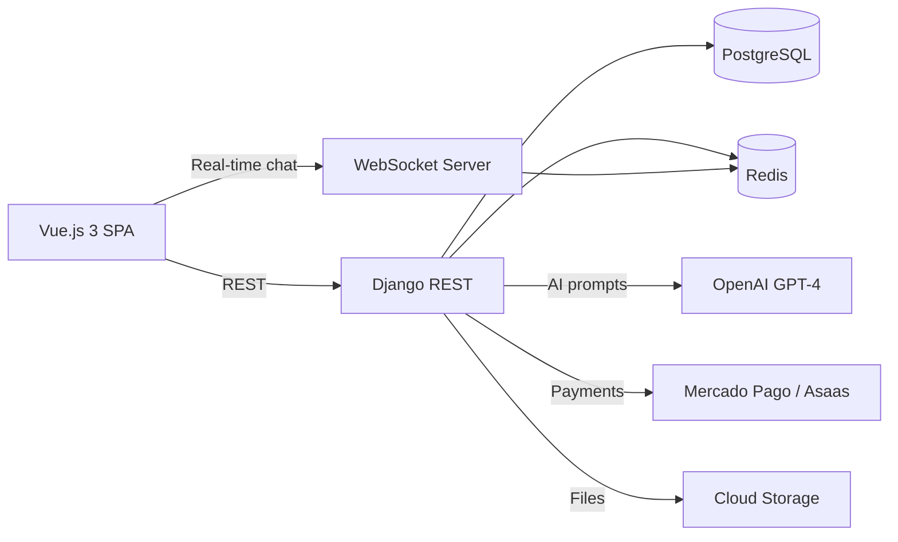

# Case Study — ProFlow AI

**Role:** Full Stack / Backend Lead  
**Stack:** Django, PostgreSQL, Vue.js 3, WebSocket, Redis, OpenAI GPT-4, Mercado Pago, Asaas  
**GitHub:** https://github.com/LeonardoRFragoso/ProFlow  
**Live:** https://www.proflow.pro

---

## 1. Business Problem

Brazilian freelancers face three critical problems:
1. **Payment insecurity:** clients do not pay or delay payments.
2. **Wrong pricing:** freelancers undercharge or overcharge.
3. **Administrative overhead:** contracts, proposals and onboarding are manual.

## 2. Solution

ProFlow is a SaaS platform with four pillars:
1. **ProFlow AI** — GPT-4 consultant for pricing, proposals and contracts.
2. **ProFlow Secure** — Escrow payment with Mercado Pago and Asaas.
3. **ProFlow Score** — Reputation system with KYC.
4. **ProFlow Path** — Gamified onboarding for new freelancers.

## 3. Technical Architecture

## 4. Database Design

- **Users:** KYC data, reputation score, onboarding progress.
- **Projects:** Scope, milestones, escrow status.
- **Payments:** Transactions, withdrawals, PIX payouts.
- **Messages:** Chat history, real-time via WebSocket.
- **Contracts:** Generated proposals and signed documents.

## 5. API Design

- `POST /projects` — create a project with milestones.
- `POST /proposals/ai-generate` — generate a proposal with GPT-4.
- `POST /payments/escrow` — hold payment in escrow.
- `POST /payments/release` — release payment on milestone completion.
- `WS /chat/{room}` — real-time messaging.

## 6. AI Components

- **Pricing assistant:** GPT-4 analyzes project scope and market rates.
- **Proposal generator:** Creates structured proposals from briefs.
- **Contract review:** Flags risky clauses in freelancer contracts.
- **AI Auto-Fixer:** Suggests corrections for common errors.

## 7. Challenges

- **Payment compliance:** Brazilian financial regulations (PIX, escrow).
- **Real-time chat:** WebSocket state management at scale.
- **Fraud prevention:** KYC and reputation system design.
- **AI cost control:** Managing OpenAI API spend per user.

## 8. Lessons Learned

- Escrow requires clear state machines and audit trails.
- WebSocket + Redis Pub/Sub is a solid MVP real-time architecture.
- AI features must be tied to clear business outcomes to justify cost.

## 9. Scalability Considerations

- Split monolithic Django into domain services.
- Move AI processing to async Celery tasks.
- Implement database read replicas.
- Add CDN for static assets.

## 10. Screenshots

> Add screenshots here.

## 11. GitHub Repository

https://github.com/LeonardoRFragoso/ProFlow
